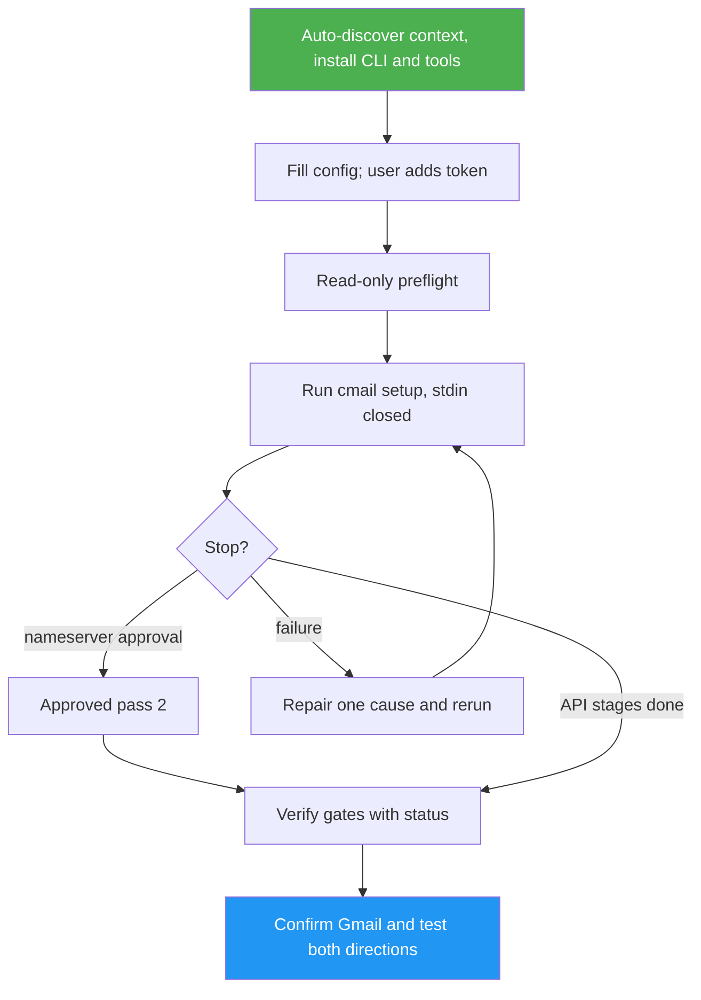

<!--
  DO NOT READ THIS FILE — This README.md is for human catalog browsing only.
  It ships inside the .skill package but is NEVER auto-loaded into agent context.
  The runtime loader only reads SKILL.md + references/ + scripts/ + agents/ when the skill triggers.
  If you're an AI agent, read the SKILL.md file instead for skill instructions.
-->

# cmail Setup

> Autonomous cmail setup: the agent installs, configures and runs `cmail setup` itself, troubleshoots failures and verifies every gate, asking only when input is missing, a step needs your hands, or a decision is important.

Author: Luong NGUYEN <luongnv89@gmail.com>

## Highlights

- Auto-detect OS, installed/source cmail, config presence and tools; undetectable
  facts stay unknown. Run the reviewed installer and install missing tools.
- Fill non-secret config itself, then run `cmail setup` after a read-only preflight.
- Stop only for missing values, hands-on steps (token, browser approvals, Gmail),
  nameserver changes, existing mail/DNSSEC records, purchases, sudo or repeated failure.
- Keep credentials in your local browser/editor, never in chat.
- On a failed gate, repair one cause and repeat the original check.

## When to Use

| Say this... | Skill will... |
|---|---|
| “Help me set up cmail.” | Install, configure and run setup, then verify through independently tested mail delivery. |
| “My Cloudflare token is active but setup fails.” | Separate resource scope from token activity and recheck access. |
| “Resume my Gmail send-as setup.” | Check confirmation and both mail directions for each alias. |

## How It Works



## Usage

Copy the **entire** `skills/cmail-setup/` directory into your agent's supported
skill directory, retaining references/scripts/evals. For example, from a reviewed
source checkout, if no skill of this name exists yet:

```bash
mkdir -p "$HOME/.agents/skills"
cp -R skills/cmail-setup "$HOME/.agents/skills/cmail-setup"
```

Do not overwrite an existing skill blindly. Reload your agent's skill discovery
as required by that agent. For agents supporting slash skills:

```text
/cmail-setup
```

Otherwise ask “Use cmail-setup to help configure my custom email.” This directory
is portable; the cmail runtime installer does not install agent skills. No tagged
release containing this skill is claimed. Python 3 runs its config helpers;
local manual checks are documented as a fallback.

## Resources

| Path | Description |
|---|---|
| `references/discovery.md` | Read-only context probes and the context block printed before any question. |
| `references/autonomous-run.md` | Preflight, the two setup passes and how to classify each stop. |
| `references/verification.md` | Nine gates with prerequisites, action, evidence, failure and recheck. |
| `references/configuration.md` | Non-secret inputs, browser-local credential acquisition and private config. |
| `references/troubleshooting.md` | Repairs keyed by setup's stopped step, marked auto or stop. |
| `scripts/check_config.py` | Offline literal-assignment/privacy checker; `--summary` shows non-secret values only. |
| `scripts/set_config.py` | Sets non-secret keys atomically at mode 600; refuses secret keys. |
| `evals/evals.json` | Eighteen realistic/adversarial prompts including a negative trigger. |

## Output

Progress lines as gates pass, and a short gate report at each stop and at exit:
result, sanitized evidence, uncertainty and the decision needed. Success requires
every requested alias's confirmed send-as and independent inbound/outbound arrival.
Token entry, browser approvals, the nameserver decision and mail tests still need
you; delivery tests do not prove universal deliverability.
