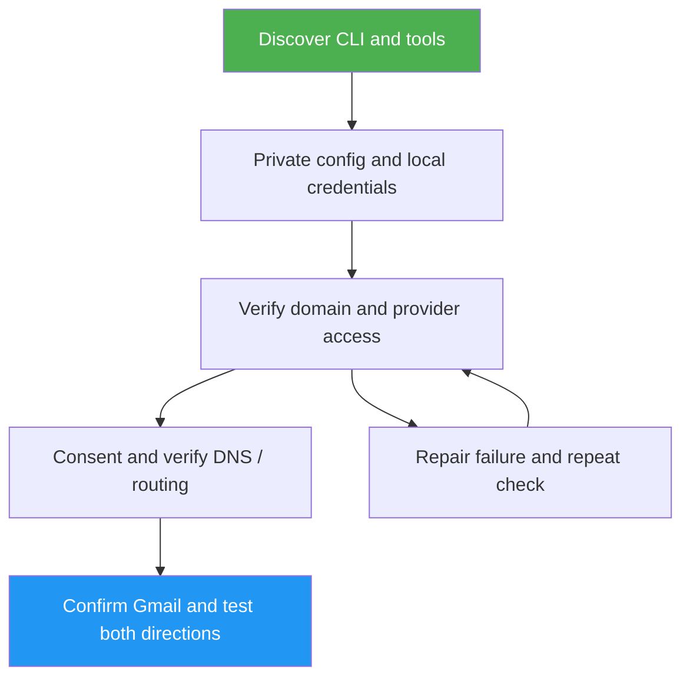

<!--
  DO NOT READ THIS FILE — This README.md is for human catalog browsing only.
  It ships inside the .skill package but is NEVER auto-loaded into agent context.
  The runtime loader only reads SKILL.md + references/ + scripts/ + agents/ when the skill triggers.
  If you're an AI agent, read the SKILL.md file instead for skill instructions.
-->

# cmail Setup

> Guided cmail installation, configuration and troubleshooting with verifiable gates and local-only secrets.

Author: Luong NGUYEN <luongnv89@gmail.com>

## Highlights

- Detect installed/source cmail and guide the reviewed one-command installer.
- Separate file readiness, provider access and delivered email evidence.
- Keep credentials in your local browser/editor, never in chat.
- Stop at failed gates, repair one cause, and repeat the original check.

## When to Use

| Say this... | Skill will... |
|---|---|
| “Help me set up cmail.” | Guide installation through independently tested mail delivery. |
| “My Cloudflare token is active but setup fails.” | Separate resource scope from token activity and recheck access. |
| “Resume my Gmail send-as setup.” | Check confirmation and both mail directions for each alias. |

## How It Works



## Usage

Copy the **entire** `skills/cmail-setup/` directory into your agent's supported
skill directory, retaining references/scripts/evals. For example, from a reviewed
source checkout, if no skill of this name exists yet:

```bash
mkdir -p "$HOME/.agents/skills"
cp -R skills/cmail-setup "$HOME/.agents/skills/cmail-setup"
```

Do not overwrite an existing skill blindly. Reload your agent's skill discovery
as required by that agent. For agents supporting slash skills:

```text
/cmail-setup
```

Otherwise ask “Use cmail-setup to help configure my custom email.” This directory
is portable; the cmail runtime installer does not install agent skills. No tagged
release containing this skill is claimed. Python 3 is optional for its offline
config checker; local manual checks are documented as a fallback.

## Resources

| Path | Description |
|---|---|
| `references/verification.md` | Nine gates with prerequisites, action, evidence, failure and recheck. |
| `references/configuration.md` | Non-secret inputs, browser-local credential acquisition and private config. |
| `references/troubleshooting.md` | Targeted recovery without blind retries. |
| `scripts/check_config.py` | Offline literal-assignment/privacy checker; never sources config. |
| `evals/evals.json` | Eight realistic/adversarial prompts including a negative trigger. |

## Output

A short gate report with result, sanitized evidence, uncertainty and next action/
consent. Success requires every requested alias's confirmed send-as and independent
inbound/outbound arrival. Browser steps and mail tests require user participation;
this is not an unattended installer or proof of universal deliverability.
